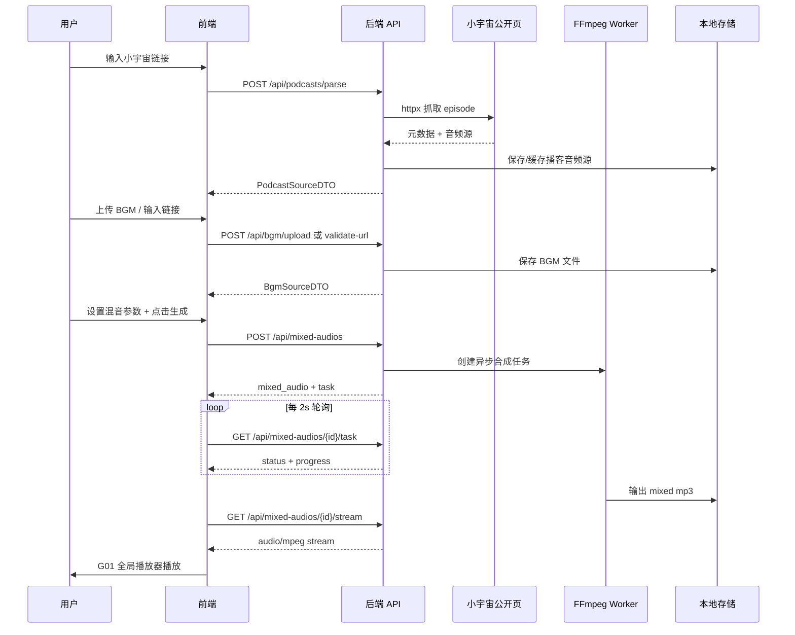
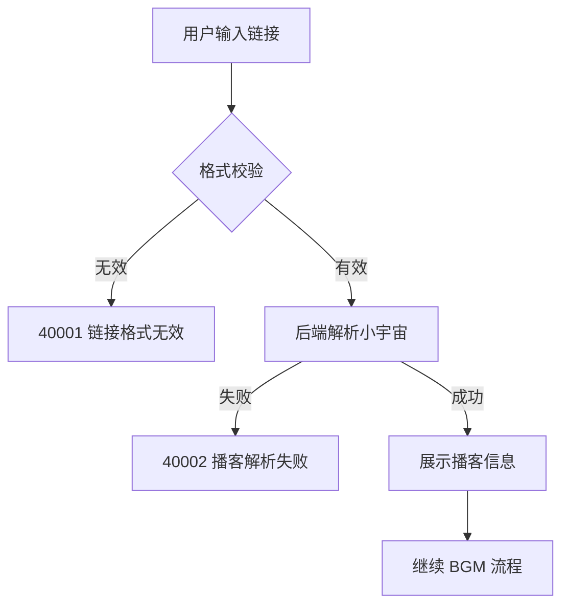

# Podcast Flow — 产品需求文档（PRD 定稿）

> 阶段 C 定稿 · 2026-06-25  
> 项目路径：`Projects_Repo/podcast-flow/`  
> 关联文档：`docs/api-contracts.md` · `docs/Plan.md` · `docs/prototypes/`

---

## 1. 背景与调研结论

### 1.1 项目定义

Podcast Flow 是一个 Web 端播客 BGM 增强播放工具。用户输入小宇宙公开播客单集链接，添加 BGM 音频并设置混音参数，系统在后端生成完整组合音频并保存为个人资产，用户可在前端完整播放，**不提供任何下载能力**。

### 1.2 核心问题

现有播客平台（小宇宙、喜马拉雅等）仅提供原始播客播放，用户无法按个人偏好叠加专注、静心、白噪音等 BGM，也缺少「增强播放 + 个人资产收藏」能力。

### 1.3 调研结论（阶段 R · 融合方案 A+B）

| 参考 | 借鉴 | 不采用 |
|------|------|--------|
| 小宇宙 | 封面+标题信息层级、单集卡片、播放器交互、封面主题色 | 社区/评论/下载/发现页 |
| Mixle | BGM 混听价值表达、ambient 面板式交互、沉浸播放 | 实时混音、离线下载、Premium |
| ENDE Automixer | 创建页步骤感、混音参数控件 | 导出下载、Web Audio 方案 |

视觉规则详见：`.sdd/tmp/visual-research.md`

### 1.4 技术栈

| 层 | 选型 |
|----|------|
| 前端 | React + TypeScript + Vite + Ant Design |
| 后端 | Python 3.11+ / FastAPI / PyCore |
| 音频处理 | FFmpeg |
| 存储（MVP） | 本地文件系统 + SQLite |
| 响应格式 | `{ code, message, data }` |

---

## 2. 页面清单与跳转逻辑（A1）

### 2.1 页面清单

| 序号 | 页面名称 | 页面类型 | 可见角色 | 入口来源 | 跳转去向 |
|------|---------|---------|---------|---------|---------|
| P01 | 首页 / 创建组合音频 | 表单+流程页 | 所有访客 | 顶栏「创建」、音频库「创建新组合」、`/` | P02、P03、G01 |
| P02 | 我的组合音频库 | 列表页 | 当前 session 用户 | 顶栏「我的音频库」、P01 成功引导 | P01、P03、G01 |
| P03 | 组合音频详情 | 详情页 | 当前 session 用户 | P02「详情」、P01「查看详情」 | P02、G01 |
| G01 | 全局底部播放器 | 全局浮层 | 播放时所有页面 | P01/P02/P03「播放」 | — |

### 2.2 全局布局

```text
顶栏：Podcast Flow Logo + [创建] + [我的音频库]
主内容区：P01 / P02 / P03
底部：G01 全局播放器（播放时固定）
```

### 2.3 页面跳转图

```text
P01 创建页 ──生成成功──→ [播放→G01] [详情→P03] [音频库→P02]
P02 音频库 ──[详情]──→ P03
P02 音频库 ──[创建]──→ P01
P03 详情页 ──[返回/删除]──→ P02
```

---

## 3. 主要功能定义与分析（A2）

### 3.1 P01 首页 / 创建组合音频

| 功能编号 | 功能名称 | 一句话描述 | 完成标准 |
|---------|---------|-----------|---------|
| F-01-01 | 产品介绍展示 | 展示产品名、核心价值与支持范围 | 进入即见介绍及支持范围说明 |
| F-01-02 | 小宇宙链接输入 | 输入 episode 链接并触发解析 | 可输入、见格式提示、点解析 |
| F-01-03 | 链接格式校验 | 校验 xiaoyuzhoufm.com/episode/{id} | 非法即时提示 |
| F-01-04 | 播客信息解析 | 后端解析并展示元数据 | 封面/标题/播客名/时长/摘要 |
| F-01-05 | BGM 本地上传 | 上传本地 BGM | 可选文件、见校验状态 |
| F-01-06 | BGM 链接输入 | 输入公开 BGM 链接 | 可输入 URL 并校验 |
| F-01-07 | BGM 校验 | 校验 BGM 可用性 | 显示可用/不可用及原因 |
| F-01-08 | 混音参数设置 | 播客音量、BGM 音量、循环 | Slider + 开关，默认值可见 |
| F-01-09 | 生成组合音频 | 提交后端合成任务 | 点击后进入任务流程 |
| F-01-10 | 合成任务状态 | 展示进度与结果 | 等待/合成/成功/失败，可重试 |
| F-01-11 | 生成成功引导 | 成功后引导操作 | 播放/详情/音频库三按钮 |

**边界**：不含淡入淡出、实时预览、多平台链接、前端暴露原始音频 URL。

### 3.2 P02 我的组合音频库

| 功能编号 | 功能名称 | 一句话描述 | 完成标准 |
|---------|---------|-----------|---------|
| F-02-01 | 音频资产列表 | 展示所有组合音频 | 卡片含封面/标题/BGM/时长/状态/时间 |
| F-02-02 | 创建入口 | 快捷进入创建 | 顶部按钮跳转 P01 |
| F-02-03 | 卡片播放 | 全局播放器播放 | 点击播放 G01 出现 |
| F-02-04 | 查看详情 | 进入详情页 | 跳转 P03 |
| F-02-05 | 删除资产 | 删除组合音频 | 确认后消失且不可播放 |
| F-02-06 | 空状态 | 无资产引导 | 提示创建第一个 |
| F-02-07 | 列表排序 | 创建时间倒序 | 最新在前 |

**边界**：不含搜索、筛选、重新生成、批量删除。

### 3.3 P03 组合音频详情

| 功能编号 | 功能名称 | 一句话描述 | 完成标准 |
|---------|---------|-----------|---------|
| F-03-01 | 基础信息展示 | 完整元数据 | 封面/标题/播客名/原链接/时长/时间 |
| F-03-02 | 内嵌播放器 | 页面内播放 | 播放/暂停/进度/音量 |
| F-03-03 | BGM 信息展示 | BGM 来源信息 | 名称/来源类型/时长 |
| F-03-04 | 混音参数展示 | 生成配置只读展示 | 音量/循环状态 |
| F-03-05 | 删除资产 | 删除当前资产 | 确认后跳转 P02 |
| F-03-06 | 返回导航 | 返回音频库 | 跳转 P02 |

**边界**：不含下载、分享、参数编辑、重新生成。

### 3.4 G01 全局底部播放器

| 功能编号 | 功能名称 | 一句话描述 | 完成标准 |
|---------|---------|-----------|---------|
| F-G1-01 | 跨页播放 | 切页不中断 | 页面切换音频继续 |
| F-G1-02 | 播放控制 | 播放/暂停/进度/时间 | 底部 bar 可操作 |
| F-G1-03 | 音量控制 | 调节音量 | 底部 Slider |
| F-G1-04 | 当前信息展示 | 封面与标题 | bar 左侧展示 |
| F-G1-05 | 关闭播放器 | 停止并隐藏 | 关闭后 bar 消失 |

### 3.5 全局约束

| 编号 | 约束 |
|------|------|
| X-01 | 全站不提供下载 |
| X-02 | MVP 无登录，session 隔离 |
| X-03 | 原始播客音频 URL 不返回前端 |

---

## 4. Mission、Persona 与版本规划（A3）

### 4.1 Mission

帮助播客用户将小宇宙公开单集与个性化 BGM 合成为可保存、可复听的沉浸式组合音频，并在 Web 端完整播放。

### 4.2 Persona

| 角色 | 场景 | 诉求 |
|------|------|------|
| 专注型听众 | 学习/工作 | 播客 + 轻音乐/白噪音 |
| 放松型听众 | 夜间/睡前 | 播客 + 低音量环境音 |
| 复听型听众 | 反复收听 | 保存组合版本一键播放 |

### 4.3 V1 / MVP 范围

**包含**：P01 全功能、P02 列表/播放/删除、P03 详情/播放/删除、G01 基础跨页播放、小宇宙链接解析、BGM 上传/链接、FFmpeg 后端合成、本地存储、stream 播放。

**排除**：淡入淡出、实时预览、搜索筛选、重新生成、登录、云存储、多平台、下载、分享。

### 4.4 V2+ 路线图

| 功能 | 版本 | 理由 |
|------|------|------|
| 淡入/淡出 | V1.1 | FFmpeg filter 增量 |
| 重新生成 | V1.1 | 需配置快照 |
| 搜索/筛选 | V1.2 | 资产增多后价值 |
| 播放进度记忆 | V1.2 | 需持久化 |
| 内置 BGM 模板 | V1.2 | 素材与版权 |
| 用户登录 + 云存储 | V2.0 | 架构变更 |
| 多平台解析 | V2.0 | 各平台独立逻辑 |
| 实时调音 | V2.0 | 技术路线不同 |

### 4.5 业务规则

| 编号 | 规则 |
|------|------|
| BR-01 | 仅接受 `xiaoyuzhoufm.com/episode/{id}` 公开单集 |
| BR-02 | 原始播客音频源仅存后端 |
| BR-03 | 全站禁止下载，stream 响应 `Content-Disposition: inline` |
| BR-04 | BGM 支持 mp3/m4a/wav，单文件 ≤ 50MB |
| BR-05 | 默认：播客 100%、BGM 15%、循环开启 |
| BR-06 | 合成异步，前端轮询 |
| BR-07 | 资产按 session_id 隔离 |
| BR-08 | 删除同时删文件 |
| BR-09 | 合成失败可重试 |

---

## 5. 复杂功能业务链路与关键实现思路（A4）

### 5.1 小宇宙链接解析链路（P01 · F-01-03/04）

- **触发场景**：用户输入链接并点击「解析播客」
- **实现思路**：
  1. 前端正则校验 URL 格式：`https://www.xiaoyuzhoufm.com/episode/{episode_id}`
  2. 后端接收 episode_id，请求小宇宙公开 episode 页面或内部 API（httpx，`trust_env=False`）
  3. 解析 HTML/JSON 提取：标题、播客名、封面 URL、时长、简介
  4. 解析可播放音频源 URL，**仅存后端** `podcast_sources.audio_source_url`
  5. 返回前端 DTO（不含 audio_source_url）
- **失败策略**：解析失败返回明确错误码，前端提示检查链接或更换公开单集
- **风险**：小宇宙页面结构变更可能导致解析失效；MVP 接受此风险，不做 100% 稳定性承诺

### 5.2 BGM 校验链路（P01 · F-01-05/06/07）

- **触发场景**：用户上传文件或输入 BGM 链接
- **实现思路**：
  1. **上传**：multipart 上传至 `storage/bgm/`，校验扩展名与文件头（ffprobe）
  2. **链接**：后端 HEAD/GET 预检，校验 Content-Type 与可读取性，临时下载至 storage
  3. 提取 duration、format，写入 `bgm_sources` 表
  4. 返回校验结果（available / unavailable + reason）
- **支持格式**：mp3、m4a、wav；单文件 ≤ 50MB

### 5.3 FFmpeg 音频合成链路（P01 · F-01-09/10）

- **触发场景**：用户点击「生成组合音频」
- **实现思路**：
  1. 创建 `mix_tasks` 记录，状态 `pending`
  2. 后台 worker 拉取任务，状态 → `mixing`
  3. FFmpeg 命令逻辑：
     - 播客轨：按 `podcast_volume` 调音量
     - BGM 轨：按 `bgm_volume` 调音量；若 `bgm_loop=true` 则 loop 至播客时长
     - 混音：`amix` 或 `filter_complex` 合并两轨
     - 输出：mp3 至 `storage/mixed/{mixed_id}.mp3`
  4. 成功 → `mixed_audio_assets` 状态 `completed`；失败 → `failed` + error_message
  5. 前端每 2s 轮询任务状态，展示粗粒度进度（可选 ffprobe 估算）
- **关键技术**：系统需安装 FFmpeg；Python 侧 `subprocess` 调用，超时控制（如 30min）

### 5.4 Stream 播放链路（P02/P03/G01 · 不含下载）

- **触发场景**：用户点击「播放」
- **实现思路**：
  1. 前端请求 `GET /api/mixed-audios/{id}/stream`
  2. 后端校验 session 归属，读取本地 mp3 文件
  3. 返回 `StreamingResponse`，`Content-Type: audio/mpeg`，`Content-Disposition: inline`
  4. 支持 HTTP Range 请求（断点续传/拖动进度条）
  5. **禁止** `attachment` 响应头；前端 `<audio>` 或 Howler.js 播放
- **安全**：stream 接口校验 session_id 与 mixed_audio 归属

### 5.5 Session 资产隔离（全局 · BR-07）

- **实现思路**：
  1. 首次访问后端生成 `session_id`（UUID），写入 HttpOnly Cookie
  2. 所有资产表含 `session_id` 字段
  3. 列表/详情/播放/删除均过滤当前 session
  4. MVP 不跨浏览器/设备同步

---

## 6. 数据契约确认清单（A5）

### 6.1 业务数据契约

#### 6.1.1 PodcastSource（播客来源）

| 字段 | 类型 | 说明 |
|------|------|------|
| id | string (UUID) | 主键 |
| session_id | string | 所属 session |
| source_type | enum | `xiaoyuzhou_episode` |
| source_url | string | 用户输入的小宇宙链接 |
| episode_id | string | 从 URL 提取 |
| title | string | 单集标题 |
| podcast_name | string | 播客名称 |
| cover_url | string | 封面 URL |
| duration | integer | 时长（秒） |
| description | string? | 简介摘要 |
| audio_source_url | string | **后端内部**，不返回前端 |
| created_at | datetime | 创建时间 |

#### 6.1.2 BgmSource（BGM 来源）

| 字段 | 类型 | 说明 |
|------|------|------|
| id | string (UUID) | 主键 |
| session_id | string | 所属 session |
| source_type | enum | `upload` / `url` |
| source_url | string? | BGM 链接（upload 时为 null） |
| file_path | string | 本地存储路径 |
| title | string | BGM 名称 |
| duration | integer | 时长（秒） |
| format | string | mp3 / m4a / wav |
| status | enum | `available` / `unavailable` |
| created_at | datetime | 创建时间 |

#### 6.1.3 MixConfig（混音配置）

| 字段 | 类型 | 说明 | 默认值 |
|------|------|------|--------|
| podcast_volume | float | 播客音量 0.0–1.0 | 1.0 |
| bgm_volume | float | BGM 音量 0.0–1.0 | 0.15 |
| bgm_loop | boolean | BGM 循环铺满 | true |
| fade_in | integer? | 淡入秒数（V2） | null |
| fade_out | integer? | 淡出秒数（V2） | null |

#### 6.1.4 MixedAudioAsset（组合音频资产）

| 字段 | 类型 | 说明 |
|------|------|------|
| id | string (UUID) | 主键 |
| session_id | string | 所属 session |
| podcast_source_id | string (FK) | 播客来源 |
| bgm_source_id | string (FK) | BGM 来源 |
| title | string | 组合音频标题（默认：播客标题 + " - Mix"） |
| duration | integer | 时长（秒） |
| mix_config | MixConfig | 混音配置 JSON |
| status | enum | `pending` / `mixing` / `completed` / `failed` |
| output_file_path | string? | 合成文件路径 |
| error_message | string? | 失败原因 |
| created_at | datetime | 创建时间 |
| updated_at | datetime | 更新时间 |

#### 6.1.5 MixTask（合成任务）

| 字段 | 类型 | 说明 |
|------|------|------|
| id | string (UUID) | 主键 |
| mixed_audio_id | string (FK) | 关联资产 |
| status | enum | `pending` / `mixing` / `completed` / `failed` |
| progress | integer | 0–100 |
| error_message | string? | 失败原因 |
| started_at | datetime? | 开始时间 |
| completed_at | datetime? | 完成时间 |

#### 6.1.6 Session

| 字段 | 类型 | 说明 |
|------|------|------|
| session_id | string (UUID) | Cookie 标识 |
| created_at | datetime | 创建时间 |

#### 6.1.7 状态流转

**MixTask / MixedAudioAsset 状态：**

```text
pending → mixing → completed
                 ↘ failed（可重新触发生成，新建 task 或重置状态）
```

**BgmSource 状态：**

```text
上传/链接 → 校验 → available / unavailable
```

### 6.2 接口响应格式契约（A5-2）

#### 统一响应格式

```json
// 成功
{ "code": 200, "message": "success", "data": { ... } }

// 错误
{ "code": <错误码>, "message": "<错误描述>", "data": null }

// 分页（V2 预留）
{ "code": 200, "message": "success", "data": { "items": [], "total": 0, "page": 1, "page_size": 20 } }
```

#### HTTP 状态码约定

| HTTP | 含义 |
|------|------|
| 200 | 成功 |
| 400 | 参数错误 |
| 401 | 未认证（session 无效） |
| 403 | 无权限（资产不属于当前 session） |
| 404 | 资源不存在 |
| 500 | 服务器内部错误 |

#### 业务错误码（code 字段）

| code | 含义 |
|------|------|
| 200 | 成功 |
| 40001 | 链接格式无效 |
| 40002 | 播客解析失败 |
| 40003 | BGM 格式不支持 |
| 40004 | BGM 文件过大 |
| 40005 | BGM 不可用 |
| 40006 | 合成任务失败 |
| 40401 | 资源不存在 |
| 40301 | 无权访问该资产 |

#### 核心 API 清单（MVP）

| 方法 | 路径 | 说明 |
|------|------|------|
| POST | `/api/podcasts/parse` | 解析小宇宙链接 |
| POST | `/api/bgm/upload` | 上传 BGM |
| POST | `/api/bgm/validate-url` | 校验 BGM 链接 |
| POST | `/api/mixed-audios` | 创建合成任务 |
| GET | `/api/mixed-audios/{id}/task` | 查询任务状态 |
| GET | `/api/mixed-audios` | 列表（当前 session） |
| GET | `/api/mixed-audios/{id}` | 详情 |
| GET | `/api/mixed-audios/{id}/stream` | stream 播放 |
| DELETE | `/api/mixed-audios/{id}` | 删除资产 |

#### 前端 DTO 约束

- `PodcastSourceDTO`：**不含** `audio_source_url`
- `MixedAudioAssetDTO`：含 `play_url`（相对路径 `/api/mixed-audios/{id}/stream`），**不含** `output_file_path`
- `download_enabled` 字段固定为 `false`，前端不渲染下载 UI

---

## 7. 外部依赖与配置（A5-3 · 已确认）

| 依赖 | 用途 | 关键配置字段 | Key/账号来源 | 存放位置 | 缺失时策略 | 状态 |
|------|------|-------------|-------------|----------|-----------|------|
| FFmpeg | 音频合成、格式探测 | `FFMPEG_PATH` / `FFPROBE_PATH` | 系统安装（brew/apt） | 系统级 | 启动检测，缺失拒绝合成 | **已确认** |
| 小宇宙公开页面 | 解析 episode 元数据与音频源 | 无 API Key | 无需账号 | — | 解析失败提示换链接；开发可 Mock | **已确认** |
| 本地文件存储 | BGM/合成音频存储 | `STORAGE_ROOT` | 项目本地目录 | backend/.env | MVP 本地磁盘 | **已确认** |
| SQLite | 业务数据持久化 | `DATABASE_URL` | 项目内置 | backend/.env | 默认 SQLite | **已确认** |
| LLM / Embedding / Rerank | — | — | — | — | **无** | 无 |
| 对象存储 OSS/S3 | — | — | — | — | V2 再引入 | 无 |
| 支付 / 短信 / 推送 | — | — | — | — | **无** | 无 |
| 第三方登录 / OAuth | — | — | — | — | **无** | 无 |

### 推荐 `.env` 草稿

```env
# backend/.env
STORAGE_ROOT=./storage
DATABASE_URL=sqlite:///./data/podcast_flow.db
FFMPEG_PATH=ffmpeg
FFPROBE_PATH=ffprobe
MAX_BGM_FILE_SIZE_MB=50
SESSION_COOKIE_NAME=podcast_flow_session
CORS_ORIGINS=http://localhost:5173
```

---

## 8. AI 功能

无 AI 功能。本项目不涉及 LLM、Embedding、Rerank 或智能推荐。

---

## 9. 附录：P01 创建页分区结构

```text
1. 顶部介绍区
2. 小宇宙链接输入区
3. 播客解析信息区
4. BGM 添加区
5. 混音参数设置区
6. 生成任务区
7. 生成成功区
```

---

## 10. 路线图终版（阶段 C）

### MVP V1.0（当前开发范围）

```text
小宇宙链接解析 → BGM 上传/链接 → 混音配置 → FFmpeg 合成 → 资产保存 → 列表/详情 → Stream 播放
```

| 里程碑 | 交付物 | 验收标准 |
|--------|--------|---------|
| M1 前端 Mock | P01/P02/P03/G01 | UI 与原型一致，Mock 流程可走通 |
| M2 后端基础 | health + session + db | GET /health 200，ffmpeg 检测通过 |
| M3 核心闭环 | 解析+BGM+合成+播放 | 真实小宇宙链接可生成并播放 |
| M4 资产管理 | 列表+详情+删除 | Session 隔离，删除后不可播放 |

### V1.1 / V1.2 / V2.0

见第 4.4 节 V2+ 路线图，不在 MVP 开发范围。

---

## 11. 技术架构蓝图（阶段 C）

### 11.1 分层架构

```text
┌─────────────────────────────────────────────┐
│  Frontend (React + Vite + Ant Design)        │
│  pages / components / stores / services      │
└──────────────────┬──────────────────────────┘
                   │ HTTP + Cookie (Session)
┌──────────────────▼──────────────────────────┐
│  Backend API (FastAPI + PyCore)              │
│  routes / services / middleware              │
├──────────────────┬──────────────────────────┤
│  Mix Worker      │  Xiaoyuzhou Parser       │
│  (FFmpeg async)  │  (httpx)                 │
└──────────────────┬──────────────────────────┘
                   │
┌──────────────────▼──────────────────────────┐
│  SQLite (metadata)  +  Local FS (audio files)│
└─────────────────────────────────────────────┘
```

### 11.2 目录结构（规划）

```text
Projects_Repo/podcast-flow/
├── frontend/          # React 生产前端
├── backend/           # FastAPI 生产后端
├── pycore/            # 已有脚手架
├── storage/           # 运行时音频文件（gitignore）
├── data/              # SQLite 数据库（gitignore）
└── docs/
    ├── PRD.md
    ├── api-contracts.md
    ├── Plan.md
    └── prototypes/
```

### 11.3 部署方案（MVP）

| 组件 | MVP 方案 |
|------|---------|
| 前端 | Vite build → 静态文件或 Nginx |
| 后端 | uvicorn 单进程 + 内置 Mix Worker |
| 数据库 | SQLite 单文件 |
| 文件存储 | 本地 `storage/` 目录 |
| FFmpeg | 宿主机系统依赖 |

---

## 12. 原型说明（阶段 C）

| 原型文件 | 对应页面 | 路由（生产） |
|---------|---------|-------------|
| `docs/prototypes/index.html` | P01 创建组合音频 | `/` |
| `docs/prototypes/library.html` | P02 我的组合音频库 | `/library` |
| `docs/prototypes/detail.html` | P03 组合音频详情 | `/detail/:id` |
| G01 全局播放器 | 嵌入三页 | 全局组件 |

原型预览：`http://localhost:8765/index.html`（本地 http.server）

**原型 ≠ 生产代码**：生产须用 React + Ant Design 按 `api-contracts.md` 重建。

---

## 13. 核心流程图（阶段 C）

### 13.1 主流程（创建组合音频）



### 13.2 异常分支（解析失败）



---

## 14. 组件交互说明（阶段 C）

### 14.1 前端模块

| 模块 | 职责 | 依赖 |
|------|------|------|
| `pages/CreatePage` | P01 创建流程状态机 | podcastService, bgmService, mixedAudioService |
| `pages/LibraryPage` | P02 资产列表 | mixedAudioService |
| `pages/DetailPage` | P03 详情 + 内嵌播放 | mixedAudioService |
| `components/GlobalPlayer` | G01 跨页播放 | playerStore (Zustand) |
| `stores/playerStore` | 当前播放项、进度、音量 | — |
| `services/api.ts` | Axios 实例 + 拦截器 | — |

### 14.2 后端模块

| 模块 | 职责 | 调用关系 |
|------|------|---------|
| `routes/podcasts.py` | 解析接口 | → XiaoyuzhouParserService |
| `routes/bgm.py` | BGM 上传/校验 | → BgmService → ffprobe |
| `routes/mixed_audios.py` | CRUD + stream | → MixedAudioService |
| `services/mix_worker.py` | FFmpeg 异步合成 | → subprocess ffmpeg |
| `middleware/session.py` | Session Cookie | 所有 /api/* |

### 14.3 拟新增目录

```text
frontend/src/{pages,components,stores,services,types,mocks}
backend/{routes,services,models,middleware,workers}
```

---

## 15. 技术选型与风险（阶段 C）

### 15.1 关键库/方案

| 领域 | 选型 | 理由 |
|------|------|------|
| 前端框架 | React + Vite + Ant Design | SDD 默认栈，原型已验证 |
| 后端框架 | FastAPI + PyCore | 项目已有 pycore 脚手架 |
| 音频处理 | FFmpeg CLI | 成熟稳定，支持 volume/loop/amix |
| HTTP 客户端 | httpx (trust_env=False) | 小宇宙解析，禁止继承代理 |
| 数据库 | SQLite | MVP 轻量，无外部依赖 |
| 播放 | HTML5 Audio + Range | 简单可靠，无额外库 |

### 15.2 风险与缓解

| 风险 | 影响 | 缓解措施 |
|------|------|---------|
| 小宇宙页面结构变更 | 解析失败 | 独立 Parser 模块；Mock 数据支持开发；用户提示换链接 |
| FFmpeg 未安装 | 无法合成 | 启动时 health 检测；明确安装文档 |
| 长播客合成耗时 | 用户等待 | 异步任务 + 进度轮询；超时 30min |
| 本地存储磁盘满 | 合成失败 | 删除接口释放空间；V2 迁移 OSS |
| 合规：不提供下载 | 产品边界 | stream inline + UI 无下载入口 + 后端禁止 attachment |
